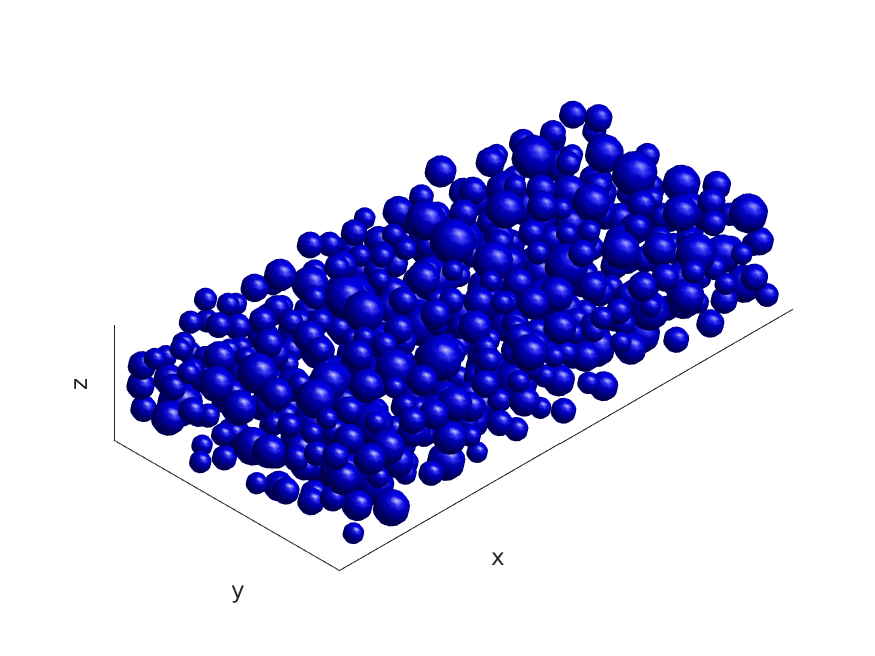
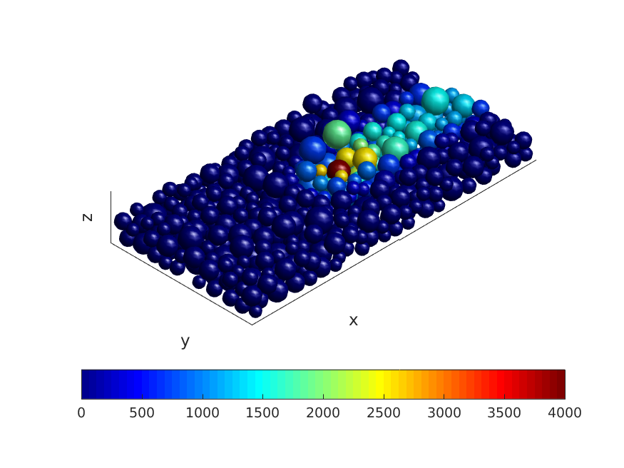

# Simulation of Laser Powder Based Fusion (L-PBF) using CUDA
A multiphysical modeling approach [1] has been employed to simulate the selected laser sintering (SLS) process (a kind of L-PBF) for a single layer of particles. A discrete element approach [1] was implemented using CUDA to model particle-to-particle and particle-to-wall mechanical and thermal interactions. The modeling approach can be characterized in two parts: (1) dynamic simulation of the deposition of the powder particles; (2) thermal simulation of the temperature evolution of the particles after a single pass of a laser beam. The implementation detail and numerical experiments are described in the [report](https://github.com/zhangyaqi1989/Simulation-of-LPBF-using-CUDA/blob/master/report_and_presentation/report.pdf). A shorter presentation is in the [slides](https://github.com/zhangyaqi1989/Simulation-of-LPBF-using-CUDA/blob/master/report_and_presentation/presentation.pdf). **This project won the final project competition.**
<!--In this project, both dynamic and thermal simulation [1] of laser powder bed fusion are implemented using CUDA. 
-->

## 1. Demo
### 1.1 Dynamic Simulation
[](https://youtu.be/yeNoQOOabVg)
**[click above figure to play]**  
### 1.2 Thermal Simulation
[](https://youtu.be/KLpTbSgZREE)
**[click above figure to play]** 
## 2. Dynamic Simulation
### 2.1 Build Instructions

**Successful on Linux platform with gcc 6.4.0 and nvcc 9.0.**

On Linux PC

```
>> cd dynamics/
>> make -f makefile-pc clean
>> make -f makefile-pc
```
On Euler (a multi-core supercomputer cluster)

```
>> cd dynamics/
>> make -f makefile-euler clean
>> make -f makefile-euler
```
### 2.2 Run Instructions
CPU version
```
>> ./cpu_dynamic
```
CUDA version
```
>>> ./gpu_dynamic
```

Both CPU and GPU version will 

* output particle radius to radius.txt

* output particle initial velocity to vxyzs0.txt

* output particle initial position to xyzs0.txt

* output particle final velocity to vxyz.txt

* output particle final position to xyzs.txt

## 3. Thermal Simulation
### 3.1 Build Instructions

**Successful on Linux platform with gcc 6.4.0 and nvcc 9.0.**

On Linux PC

```
>> cd thermal/
>> make -f makefile-pc clean
>> make -f makefile-pc

```
On Euler (a multi-core supercomputer cluster)

```
>> cd thermal/
>> make -f makefile-euler clean
>> make -f makefile-euler
```
### 3.2 Run Instructions
CPU version
```
>> ./cpu_thermal <test_type>
```
CUDA version
```
>>> ./gpu_thermal <test_type>
```
test_type = 1: load xyzs.txt and radius.txt from infiles/

test_type = 2: initialize particle position and radius randomly

CPU version will output temperatures of final time step to outfiles/temperatures.txt

GPU version will output temperatures of final time step to outfiles/temperatures_cuda.txt

When test_type = 2, both CPU and GPU version will also output outfiles/xyzs_after.txt and outfiles/radius_after.txt which are the particle positions and radiuses initialized randomly. 

## References
[1] Rishi Ganeriwala and Tarek I Zohdi.  A coupled discrete element-finite difference model of selective lasersintering. *Granular Matter*, 18 (2):21, 2016. 
